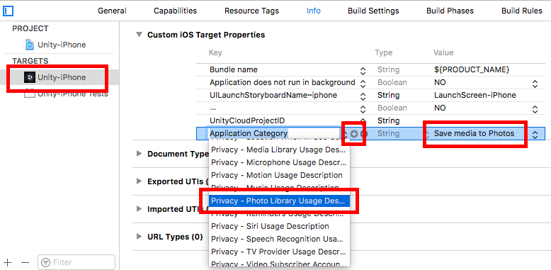

# Unity Native Gallery Plugin
This plugin helps you save your images and/or videos to device **Gallery** on Android and **Photos** on iOS. It only takes a couple of steps to set everything up:

- Import **NativeGallery.unitypackage** to your project
- *for Android*: set **Write Permission** to **External (SDCard)** in **Player Settings**
- *for iOS*: enter a **Photo Library Usage Description** in Xcode



- That's it; lol!

## How To
There are three variants of `NativeGallery.SaveToGallery` function:
1. `NativeGallery.SaveToGallery( byte[] mediaBytes, string directoryName, string filenameFormatted, bool isImage )`: use this function if you have the raw bytes of the image/video. 
- On Android, your images are saved at **DCIM/directoryName/filenameFormatted**. On iOS, directoryName has no effect. 
- **filenameFormatted** is string.Format'ed to avoid overwriting the same file on Android, if desired. If, for example, you want your images to be saved in a format like "*My img 1.png*", "*My img 2.png*" and etc., you can set the filenameFormatted as "**My img {0}.png**". *{0}* here is replaced with a unique number to avoid overwriting an existing file. If you don't use a {0} in your filenameFormatted parameter and a file with the same name exists at that path, the file will be overwritten. On the other hand, a saved image/video is **never overwritten on iOS**. 
- **isImage** should be true for images and false for videos.

2. `NativeGallery.SaveToGallery( string existingMediaPath, string directoryName, string filenameFormatted, bool isImage )`: use this function if the image/video is already saved on disk. Enter the file's path to **existingMediaPath**. The file will be **copied** to **DCIM/directoryName/filenameFormatted** on Android and *temporarily* copied to **Application.persistentDataPath/filenameFormatted** on iOS (copied file will be automatically deleted after saving the image/video as iOS keeps a separate copy of its media files in its internal directory).

3. `NativeGallery.SaveToGallery( Texture2D image, string directoryName, string filenameFormatted )`: use this function to easily save a **Texture2D** to Gallery/Photos. If filenameFormatted ends with "*.jpeg*" or "*.jpg*", texture will be saved as JPEG; otherwise, it will be saved as PNG.

4. *for Android only*: `NativeGallery.DeleteFromGallery( string path, bool isImage )`: you can use this function to remove a file located at **path** from the Gallery. For security reasons, this function is not available on iOS.

## Example Code
The following code captures the screenshot of the game and saves it to Gallery/Photos whenever you tap the screen:
```csharp
void Update()
{
	if( Input.GetMouseButtonDown( 0 ) )
		StartCoroutine( TakeSS() );
}
	
private IEnumerator TakeSS()
{
	yield return new WaitForEndOfFrame();

	Texture2D ss = new Texture2D( Screen.width, Screen.height, TextureFormat.RGB24, false );
	ss.ReadPixels( new Rect( 0, 0, Screen.width, Screen.height ), 0, 0 );
	ss.Apply();

	NativeGallery.SaveToGallery( ss, "GalleryTest", "My img {0}.png" );
}
```
