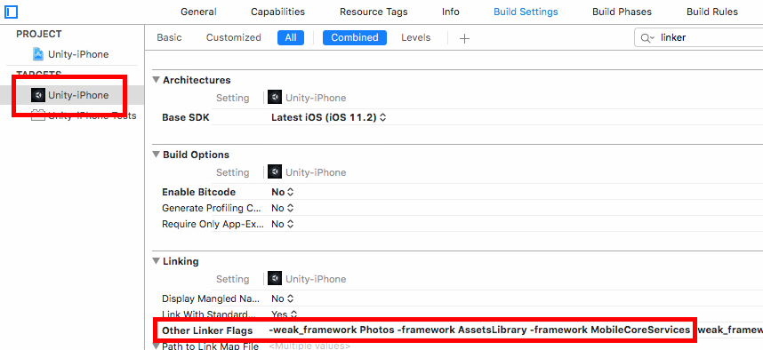

# Unity Native Gallery Plugin

**Available on Asset Store:** https://www.assetstore.unity3d.com/en/#!/content/112630

**Forum Thread:** https://forum.unity.com/threads/native-gallery-for-android-ios-open-source.519619/

This plugin helps you save your images and/or videos to device **Gallery** on Android and **Photos** on iOS. It is also possible to pick an image or video from Gallery/Photos. It takes only a couple of steps to set everything up:

- Import **NativeGallery.unitypackage** to your project
- *for Android*: set **Write Permission** to **External (SDCard)** in **Player Settings**
- *for iOS*: there are two ways to set up the plugin on iOS:

#### a. Automated Setup for iOS
- change the value of **PHOTO_LIBRARY_USAGE_DESCRIPTION** in *Plugins/NativeGallery/Editor/NGPostProcessBuild.cs* (optional)
- if your minimum *Deployment Target* (iOS Version) is at least 8.0, set the value of **MINIMUM_TARGET_8_OR_ABOVE** to *true* in *NGPostProcessBuild.cs*

#### b. Manual Setup for iOS
- set the value of **ENABLED** to *false* in *NGPostProcessBuild.cs*
- build your project
- enter a **Photo Library Usage Description** in Xcode


- also enter a **Photo Library Additions Usage Description**, if exists (see: https://github.com/yasirkula/UnityNativeGallery/issues/3)
- insert `-weak_framework Photos -framework AssetsLibrary -framework MobileCoreServices -framework ImageIO` to the **Other Linker Flags** of *Unity-iPhone Target* (if your **Deployment Target** is at least 8.0, it is sufficient to insert `-framework Photos -framework MobileCoreServices -framework ImageIO`):



- lastly, remove *Photos.framework* from **Link Binary With Libraries** of *Unity-iPhone Target* in **Build Phases**, if exists

## Upgrading From Previous Versions
Delete *Plugins/NativeGallery.cs*, *Plugins/Android/NativeGallery.jar* and *Plugins/iOS/NativeGallery.mm* before upgrading the plugin.

## How To
### A. Saving Media To Gallery/Photos
`NativeGallery.SaveImageToGallery( byte[] mediaBytes, string album, string filenameFormatted, MediaSaveCallback callback = null )`: use this function if you have the raw bytes of the image. 
- On Android, your images are saved at **DCIM/album/filenameFormatted**. On iOS, the image will be saved in the corresponding album
- **filenameFormatted** is string.Format'ed to avoid overwriting the same file on Android, if desired. If, for example, you want your images to be saved in a format like "*My img 1.png*", "*My img 2.png*" and etc., you can set the filenameFormatted as "**My img {0}.png**". *{0}* here is replaced with a unique number to avoid overwriting an existing file. If you don't use a {0} in your filenameFormatted parameter and a file with the same name does exist at that path, the file will be overwritten. On the other hand, a saved image is **never overwritten on iOS**
- **MediaSaveCallback** takes a string parameter which stores an error string if something goes wrong while saving the image/video, or *null* if it is saved successfully. This parameter is optional

`NativeGallery.SaveImageToGallery( string existingMediaPath, string album, string filenameFormatted, MediaSaveCallback callback = null )`: use this function if the image is already saved on disk. Enter the file's path to **existingMediaPath**. The file will be **copied** to **DCIM/album/filenameFormatted** on Android and *temporarily* copied to **Application.persistentDataPath/filenameFormatted** on iOS (copied file will automatically be deleted after saving the image as iOS keeps a separate copy of its media files in its internal directory).

`NativeGallery.SaveImageToGallery( Texture2D image, string album, string filenameFormatted, MediaSaveCallback callback = null )`: use this function to easily save a **Texture2D** to Gallery/Photos. If filenameFormatted ends with "*.jpeg*" or "*.jpg*", texture will be saved as JPEG; otherwise, it will be saved as PNG.

`NativeGallery.SaveVideoToGallery( byte[] mediaBytes, string album, string filenameFormatted, MediaSaveCallback callback = null )`: use this function if you have the raw bytes of the video. This function works similar to its *SaveImageToGallery* equivalent.

`NativeGallery.SaveVideoToGallery( string existingMediaPath, string album, string filenameFormatted, MediaSaveCallback callback = null )`: use this function if the video is already saved on disk. This function works similar to its *SaveImageToGallery* equivalent.

### B. Retrieving Media From Gallery/Photos
`NativeGallery.GetImageFromGallery( MediaPickCallback callback, string title = "", string mime = "image/*", int maxSize = -1 )`: prompts the user to select an image from Gallery/Photos.
- This operation is **asynchronous**! After user selects an image or cancels the operation, the **callback** is called (on main thread). **MediaPickCallback** takes a *string* parameter which stores the path of the selected image, or *null* if nothing is selected
- **title** determines the title of the image picker dialog on Android. Has no effect on iOS
- **mime** filters the available images on Android. For example, to request a *JPEG* image from the user, mime can be set as "image/jpeg". Setting multiple mime types is not possible (in that case, you should leave mime as "image/\*"). **On iOS, the selected image will always be in PNG format** and thus, this parameter has no effect on iOS 
- **maxSize** determines the maximum size of the returned image in pixels on iOS. A larger image will be down-scaled for better performance. If untouched, its value will be set to *SystemInfo.maxTextureSize*. Has no effect on Android

`NativeGallery.GetVideoFromGallery( MediaPickCallback callback, string title = "", string mime = "video/*" )`: prompts the user to select a video from Gallery/Photos. This function works similar to its *GetImageFromGallery* equivalent.

`NativeGallery.GetImagesFromGallery( MediaPickMultipleCallback callback, string title = "", string mime = "image/*", int maxSize = -1 )`: prompts the user to select one or more images from Gallery/Photos. **MediaPickMultipleCallback** takes a *string[]* parameter which stores the path(s) of the selected image(s)/video(s), or *null* if nothing is selected. Selecting multiple files from gallery is only available on *Android 18* and later (iOS not supported). Call *CanSelectMultipleFilesFromGallery()* to see if this feature is available.

`NativeGallery.GetVideosFromGallery( MediaPickMultipleCallback callback, string title = "", string mime = "video/*" )`: prompts the user to select one or more videos from Gallery/Photos. This function works similar to its *GetImagesFromGallery* equivalent.

`NativeGallery.CanSelectMultipleFilesFromGallery()`: returns true if selecting multiple images/videos from Gallery/Photos is possible on this device.

`NativeGallery.IsMediaPickerBusy()`: returns true if the user is currently picking media from Gallery/Photos. In that case, another GetImageFromGallery or GetVideoFromGallery request will simply be ignored.

Note that all these functions (except IsMediaPickerBusy) return a *NativeGallery.Permission* value. More details available below.

### C. Runtime Permissions
Beginning with *6.0 Marshmallow*, Android apps must request runtime permissions before accessing certain services, similar to iOS. There are two functions to handle permissions with this plugin:

`NativeGallery.Permission NativeGallery.CheckPermission()`: checks whether the app has access to Gallery/Photos or not.

**NativeGallery.Permission** is an enum that can take 3 values: 
- **Granted**: we have the permission to access Gallery/Photos
- **ShouldAsk**: we don't have permission yet, but we can ask the user for permission via *RequestPermission* function (see below). On Android, as long as the user doesn't select "Don't ask again" while denying the permission, ShouldAsk is returned
- **Denied**: we don't have permission and we can't ask the user for permission. In this case, user has to give the permission from Settings. This happens when user denies the permission on iOS (can't request permission again on iOS), when user selects "Don't ask again" while denying the permission on Android or when user is not allowed to give that permission (parental controls etc.)

`NativeGallery.Permission NativeGallery.RequestPermission()`: requests permission to access Gallery/Photos from the user and returns the result. It is recommended to show a brief explanation before asking the permission so that user understands why the permission is needed and doesn't click Deny or worse, "Don't ask again". Note that the SaveImageToGallery/SaveVideoToGallery and GetImageFromGallery/GetVideoFromGallery functions call RequestPermission internally and execute only if the permission is granted (the result of RequestPermission is also returned).

`NativeGallery.OpenSettings()`: opens the settings for this app, from where the user can manually grant permission in case current permission state is *Permission.Denied* (on Android, the necessary permission is named *Storage* and on iOS, the necessary permission is named *Photos*).

`bool NativeGallery.CanOpenSettings()`: on iOS versions prior to 8.0, opening settings from within app is not possible and in this case, this function returns *false*. Otherwise, it returns *true*.

### D. Utility Functions
`NativeGallery.ImageProperties NativeGallery.GetImageProperties( string imagePath )`: returns an *ImageProperties* instance that holds the width, height, mime type and EXIF orientation information of an image file without creating a *Texture2D* object. Mime type will be *null*, if it can't be determined

`NativeGallery.VideoProperties NativeGallery.GetVideoProperties( string videoPath )`: returns a *VideoProperties* instance that holds the width, height, duration (in milliseconds) and rotation information of a video file. To play a video in correct orientation, you should rotate it by *rotation* degrees clockwise. For a 90-degree or 270-degree rotated video, values of *width* and *height* should be swapped to get the display size of the video.

`Texture2D NativeGallery.LoadImageAtPath( string imagePath, int maxSize = -1, bool markTextureNonReadable = true, bool generateMipmaps = true, bool linearColorSpace = false )`: creates a Texture2D from the specified image file in correct orientation and returns it. Returns *null*, if something goes wrong.
- **maxSize** determines the maximum size of the returned Texture2D in pixels. Larger textures will be down-scaled. If untouched, its value will be set to *SystemInfo.maxTextureSize*. It is recommended to set a proper maxSize for better performance
- **markTextureNonReadable** marks the generated texture as non-readable for better memory usage. If you plan to modify the texture later (e.g. *GetPixels*/*SetPixels*), set its value to *false*
- **generateMipmaps** determines whether texture should have mipmaps or not
- **linearColorSpace** determines whether texture should be in linear color space or sRGB color space

## Example Code
The following code has three functions:
- if you click the left one-third of the screen, it captures the screenshot of the game and saves it to Gallery/Photos
- if you click the middle one-third of the screen, it picks an image from Gallery/Photos and puts it on a temporary quad that is placed in front of the camera
- if you click the right one-third of the screen, it picks a video from Gallery/Photos and plays it

```csharp
void Update()
{
	if( Input.GetMouseButtonDown( 0 ) )
	{
		if( Input.mousePosition.x < Screen.width / 3 )
		{
			// Take a screenshot and save it to Gallery/Photos
			StartCoroutine( TakeScreenshotAndSave() );
		}
		else
		{
			// Don't attempt to pick media from Gallery/Photos if
			// another media pick operation is already in progress
			if( NativeGallery.IsMediaPickerBusy() )
				return;
				
			if( Input.mousePosition.x < Screen.width * 2 / 3 )
			{
				// Pick a PNG image from Gallery/Photos
				// If the selected image's width and/or height is greater than 512px, down-scale the image
				PickImage( 512 );
			}
			else
			{
				// Pick a video from Gallery/Photos
				PickVideo();
			}
		}
	}
}

private IEnumerator TakeScreenshotAndSave()
{
	yield return new WaitForEndOfFrame();

	Texture2D ss = new Texture2D( Screen.width, Screen.height, TextureFormat.RGB24, false );
	ss.ReadPixels( new Rect( 0, 0, Screen.width, Screen.height ), 0, 0 );
	ss.Apply();

	// Save the screenshot to Gallery/Photos
	Debug.Log( "Permission result: " + NativeGallery.SaveImageToGallery( ss, "GalleryTest", "My img {0}.png" ) );
	
	// To avoid memory leaks
	Destroy( ss );
}

private void PickImage( int maxSize )
{
	NativeGallery.Permission permission = NativeGallery.GetImageFromGallery( ( path ) =>
	{
		Debug.Log( "Image path: " + path );
		if( path != null )
		{
			// Create Texture from selected image
			Texture2D texture = NativeGallery.LoadImageAtPath( path, maxSize );
			if( texture == null )
			{
				Debug.Log( "Couldn't load texture from " + path );
				return;
			}

			// Assign texture to a temporary quad and destroy it after 5 seconds
			GameObject quad = GameObject.CreatePrimitive( PrimitiveType.Quad );
			quad.transform.position = Camera.main.transform.position + Camera.main.transform.forward * 2.5f;
			quad.transform.forward = Camera.main.transform.forward;
			quad.transform.localScale = new Vector3( 1f, texture.height / (float) texture.width, 1f );
			
			Material material = quad.GetComponent<Renderer>().material;
			if( !material.shader.isSupported ) // happens when Standard shader is not included in the build
				material.shader = Shader.Find( "Legacy Shaders/Diffuse" );

			material.mainTexture = texture;
				
			Destroy( quad, 5f );

			// If a procedural texture is not destroyed manually, 
			// it will only be freed after a scene change
			Destroy( texture, 5f );
		}
	}, "Select a PNG image", "image/png", maxSize );

	Debug.Log( "Permission result: " + permission );
}

private void PickVideo()
{
	NativeGallery.Permission permission = NativeGallery.GetVideoFromGallery( ( path ) =>
	{
		Debug.Log( "Video path: " + path );
		if( path != null )
		{
			// Play the selected video
			Handheld.PlayFullScreenMovie( "file://" + path );
		}
	}, "Select a video" );

	Debug.Log( "Permission result: " + permission );
}
```
